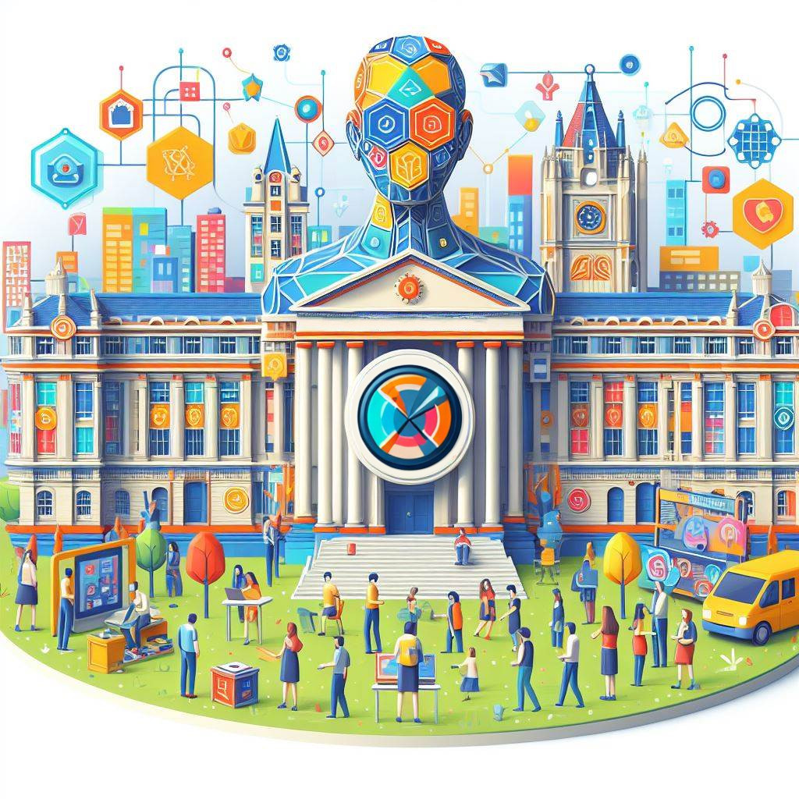

The third episode of the HCAI podcast in which we talk about interactive and responsible artificial intelligence with [Simone Stumpf](https://www.gla.ac.uk/schools/computing/staff/simonestumpf/).

<!--more-->

In this episode, we have the pleasure to talk about HCAI with Simone Stumpf, discussing topics such as responsible, explainable, and interactive AI. Simone Stumpf is a Reader in Responsible & Interactive Artificial Intelligence at the School of Computing Science at the University of Glasgow.

