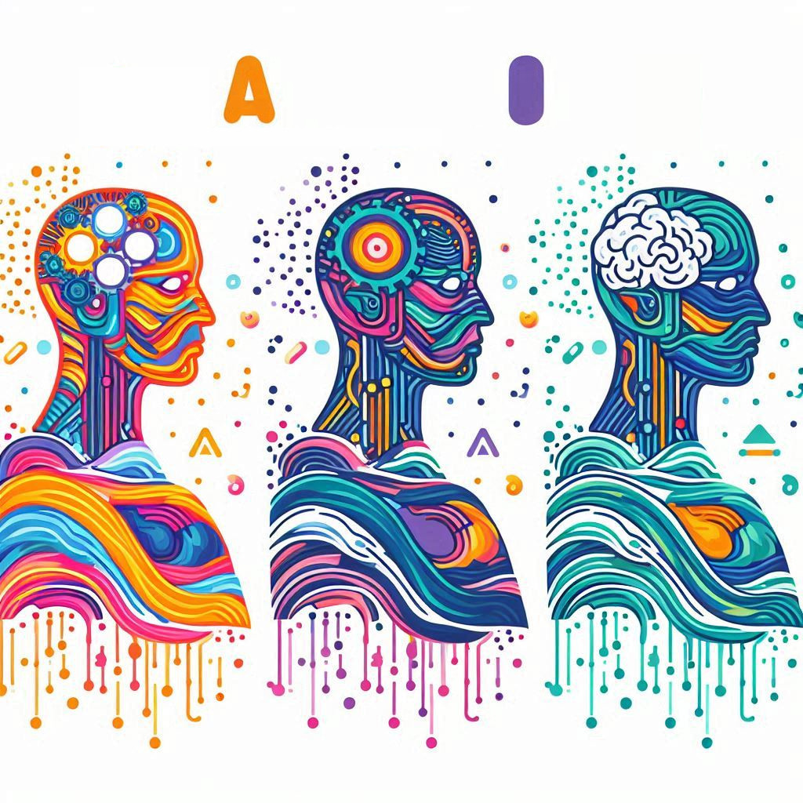

The seventh episode of the HCAI podcast in which we talk about human-computer interaction, artificial intelligence, and the interplay with society [Mikael Wiberg](https://www.umu.se/en/staff/mikael-wiberg/).

<!--more-->

In this episode of the Human-Centered Artificial Intelligence podcast, we talk to Mikael Wiberg, a professor of informatics at Umeå University. We discuss the evolution of AI through its three waves and the importance of considering the human implications and ethical responsibilities as AI becomes more integrated into society. The conversation covers the challenges of AI's environmental impact, the balance between human interaction and automation, and the need for AI to serve broader societal and ecological needs. 

<iframe style="border-radius:12px" src="https://open.spotify.com/embed/episode/3bfqRXlSwyA4LONzVoiRhg/video?utm_source=generator" width="100%" height="352" frameBorder="0" allowfullscreen="" allow="autoplay; clipboard-write; encrypted-media; fullscreen; picture-in-picture" loading="lazy"></iframe>

<!--iframe allow="autoplay *; encrypted-media *; fullscreen *; clipboard-write" frameborder="0" height="175" style="width:100%;overflow:hidden;border-radius:10px;" sandbox="allow-forms allow-popups allow-same-origin allow-scripts allow-storage-access-by-user-activation allow-top-navigation-by-user-activation" src="https://embed.podcasts.apple.com/se/podcast/human-centered-artificial-intelligence/id1717384556?i=1000658141990"></iframe-->

<iframe width="100%" height="600" https://www.youtube.com/embed/6vJi4n47yps?si=U6dOqMYZcKHzWcxE" title="HCAI Podcast Episode 8 - HCI and HCAI with Mikael Wiberg" frameborder="0" allow="accelerometer; autoplay; clipboard-write; encrypted-media; gyroscope; picture-in-picture; web-share" allowfullscreen></iframe>

