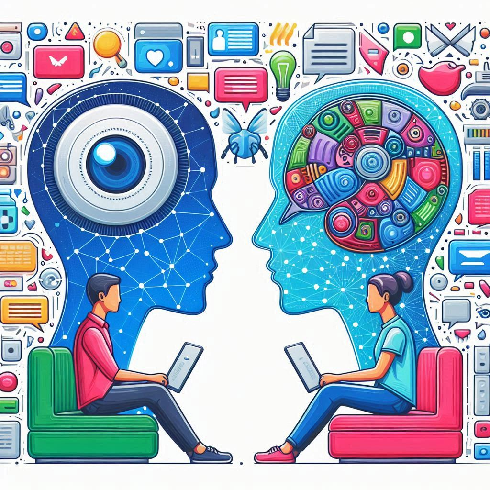

The ningth episode of the HCAI podcast in which we talk about how AI is impacting communication between people, online as well as offline, with [Mor Naaman](https://tech.cornell.edu/people/mor-naaman/).

<!--more-->

In this episode of the Human Centered AI Podcast, we welcome Mor Naaman, a professor of Information Science at Cornell Tech. Mor shares his expertise on AI-mediated communication, discussing its evolution, impacts, and ethical considerations. He recounts his experiences with AI-generated content and examines the societal implications of AI's growing role in human communication. Additionally, we speak about trust dynamics and biases introduced by AI, reflecting on the future challenges and opportunities in designing human-centered AI systems.

<iframe style="border-radius:12px" src="https://open.spotify.com/embed/episode/10R2ZXMtfnnXWocL7bDmaI/video?utm_source=generator" width="100%" height="352" frameBorder="0" allowfullscreen="" allow="autoplay; clipboard-write; encrypted-media; fullscreen; picture-in-picture" loading="lazy"></iframe>

<!--iframe allow="autoplay *; encrypted-media *; fullscreen *; clipboard-write" frameborder="0" height="175" style="width:100%;overflow:hidden;border-radius:10px;" sandbox="allow-forms allow-popups allow-same-origin allow-scripts allow-storage-access-by-user-activation allow-top-navigation-by-user-activation" src="https://embed.podcasts.apple.com/se/podcast/human-centered-artificial-intelligence/id1717384556?i=1000658141990"></iframe-->

<iframe width="100%" height="600" src="https://www.youtube.com/embed/DR95BRb7P9U?si=Jwm4vJd6_1-4Yyht" title="HCAI Episode 9 - Human-centered AI-mediated Communication with Mor Naaman" frameborder="0" allow="accelerometer; autoplay; clipboard-write; encrypted-media; gyroscope; picture-in-picture; web-share" allowfullscreen></iframe>

