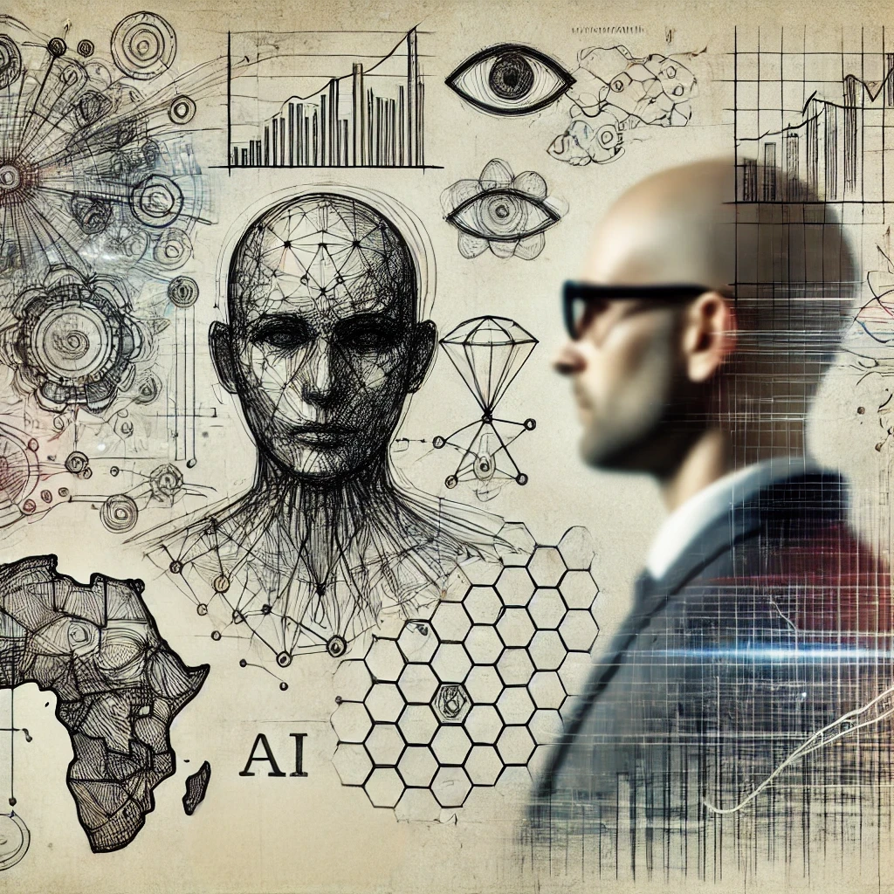

In this episode, we discuss the evolving intersection of human-computer interaction and AI with [Niklas Elmqvist](https://cs.au.dk/~elm/), a professor at Aarhus University and expert in data visualization. Niklas shares his insights on how HCI and AI can work together to create systems that amplify, augment, and empower human capabilities while ensuring transparency and user control.

<!--more-->
Niklas discusses the role of distributed cognition, cross-device analytics, and data visualization in fostering human-centered AI. Reflecting on his extensive research in ubiquitous analytics, he explains how visualization and AI can support humans in sensemaking and decision-making. He highlights the potential of AI as a glue that binds systems together while advocating for tools that enhance, rather than replace, human agency.

A key theme in the conversation is the importance of integrating advanced AI technologies, like generative AI and large language models, into interactive systems without compromising user trust or transparency. Niklas emphasizes the need for better design and innovation in HCI to keep pace with AI's rapid development, envisioning a future where humans and AI collaborate seamlessly through well-designed interfaces and tools.

This discussion offers a deep dive into the technical and philosophical aspects of human-centered AI, bridging the gap between cutting-edge AI models and user-focused design principles. Niklas’s vision resonates with the mission of HCAI, inspiring new ways to create AI systems that are powerful, trustworthy, and deeply connected to human needs.

<iframe style="border-radius:12px" src="https://open.spotify.com/embed/episode/3uymCD1OKtHvSEpftF2jTV/video?utm_source=generator" width="100%" height="351" frameBorder="0" allowfullscreen="" allow="autoplay; clipboard-write; encrypted-media; fullscreen; picture-in-picture" loading="lazy"></iframe>

<iframe allow="autoplay *; encrypted-media *; fullscreen *; clipboard-write" frameborder="0" height="175" style="width:100%;overflow:hidden;border-radius:10px;" sandbox="allow-forms allow-popups allow-same-origin allow-scripts allow-storage-access-by-user-activation allow-top-navigation-by-user-activation" src="https://embed.podcasts.apple.com/se/podcast/human-centered-artificial-intelligence/id1717384556?i=1000677880493"></iframe>

<iframe width="100%" height="600" src="https://www.youtube.com/embed/j3xii0Poy0U?si=EUxDkqWL9FemfEcW" title="HCAI 11 -  Ubiquitous HCAI with Niklas Elmqvist" frameborder="0" allow="accelerometer; autoplay; clipboard-write; encrypted-media; gyroscope; picture-in-picture; web-share" allowfullscreen></iframe>

