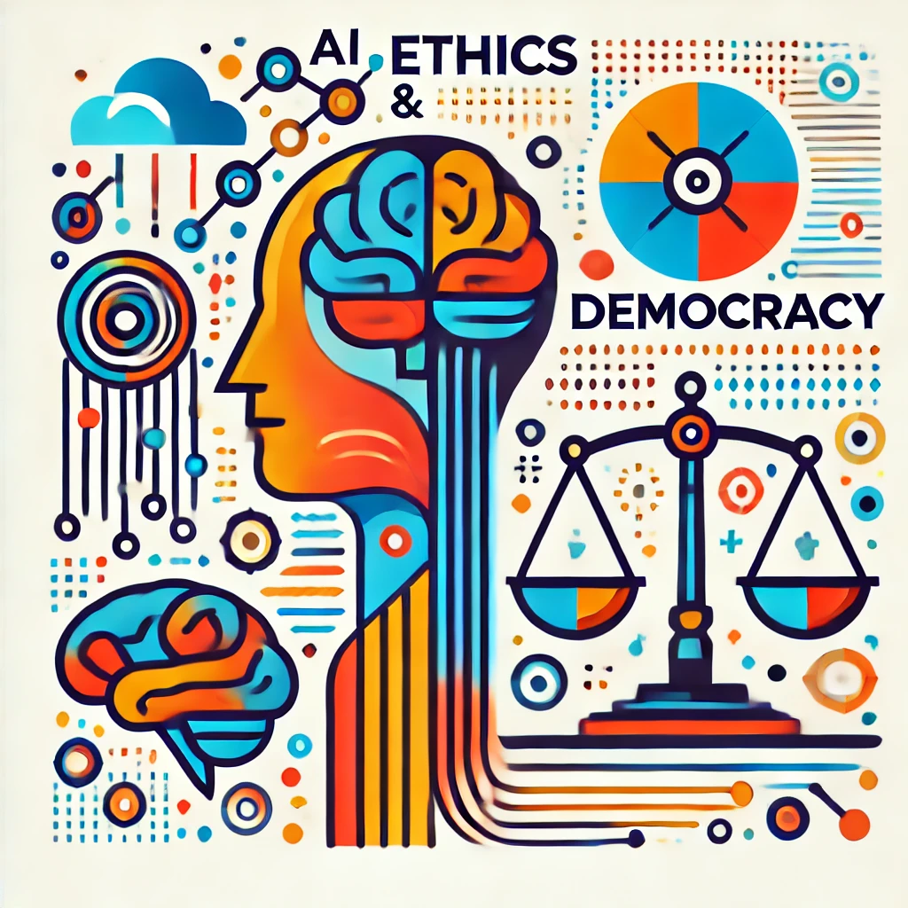

In this episode, we talk to [Mark Coeckelbergh](https://coeckelbergh.net/), Professor of Philosophy of Technology and Media at the University of Vienna, about the evolving landscape of AI and its implications for society. Mark brings a unique perspective, emphasizing the necessity of embedding ethical values into AI development from the outset to ensure the technology's responsible use aligns with both human and non-human needs. He challenges the conventional human-centered AI narrative, advocating for a more inclusive approach that considers the ecological and broader impacts of AI beyond just human interactions.

<!--more-->
The conversation explores how AI is becoming part of our everyday lives, similar to past tech revolutions like the internet. Mark stresses the importance of having democratic involvement in determining AI's future and the need for global rules to keep AI's growth ethical and beneficial. He highlights that as AI evolves, it's crucial for people from different fields to come together to ensure that AI developments serve everyone’s interests. This episode encourages us to rethink how we view AI, seeing it not just as a tech trend but a key part of our modern world.

<iframe style="border-radius:12px" src="https://open.spotify.com/embed/episode/3S3FKmEsPRhaK4wu8yTXas/video?utm_source=generator" width="100%" height="351" frameBorder="0" allowfullscreen="" allow="autoplay; clipboard-write; encrypted-media; fullscreen; picture-in-picture" loading="lazy"></iframe>

<iframe allow="autoplay *; encrypted-media *; fullscreen *; clipboard-write" frameborder="0" height="175" style="width:100%;overflow:hidden;border-radius:10px;" sandbox="allow-forms allow-popups allow-same-origin allow-scripts allow-storage-access-by-user-activation allow-top-navigation-by-user-activation" src="https://creators.spotify.com/pod/show/hcai/embed/episodes/HCAI-12---Democratizing-AI-with-Mark-Coeckelbergh-e2sfsac/a-abmhv47"></iframe>

<iframe width="100%" height="600" src="https://www.youtube.com/embed/Dt9VPJ3MATk?si=EUxDkqWL9FemfEcW" title="HCAI 12 - Democratizing AI with Mark Coeckelbergh" frameborder="0" allow="accelerometer; autoplay; clipboard-write; encrypted-media; gyroscope; picture-in-picture; web-share" allowfullscreen></iframe>

