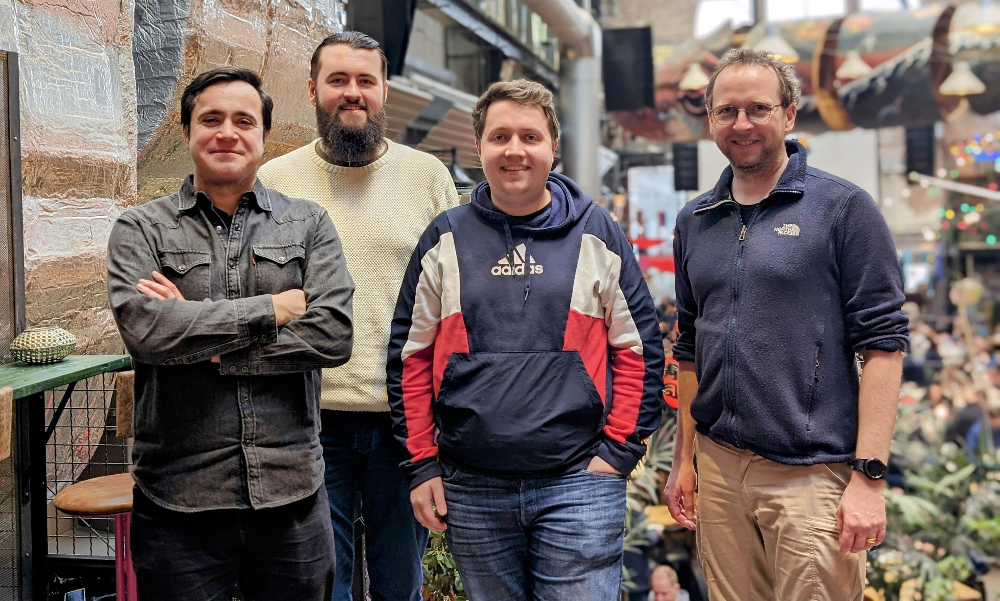

Visiting Researchers from University of Siegen.
<!--more-->

During February and March 2024, the HCAI cluster is hosting three visiting researchers from the University of Siegen's [Intelligent Systems Group](https://isg.beel.org/).

The visitors, [Prof. Joeran Beel](https://isg.beel.org/people/joeran-beel/) and Phd Students [Tobias Vente](https://isg.beel.org/people/tobias-vente/) and [Lukas Wegmeth](https://isg.beel.org/people/lukas-wegmeth/), are visiting in connection to an ongoing Vinnova project on [Automated Machine Learning for Lower CO2 Emissions](https://www.vinnova.se/en/p/automated-machine-learning-for-lower-co2-emissions/) where Joeran Beel and [Alan Said](/author/alan-said) collaborate. 

