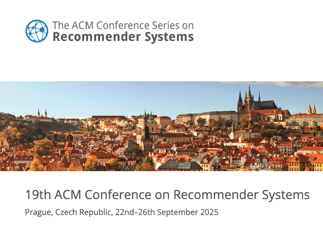

We're attending RecSys 2025 and participating in several talks, panels, workshops, and meetings across the week. Below is a short schedule of Alan's activities and our group's presentations.

<!--more-->

- **September 17** — Alan will be speaking at the summer school on "Recommender Systems for a Fair and Sustainable Future." See the summer school schedule: https://recsys-lab.at/rsss2025/schedule/

- **September 22** — Alan will give a keynote at the #RecTour2025 workshop: "Recommender Systems in Tourism through a Fair and Sustainable Lens." Details: https://workshops.ds-ifs.tuwien.ac.at/rectour25/keynote/

- **September 24** — Alan will chair the session "Reflections on User Preferences leveraging LLMs." Session info: https://recsys.acm.org/recsys25/session-4/

- **September 25** — Alan will present an LBR poster: "The Hidden Cost of Defaults in Recommender System Evaluation" (joint work with Hannah Berling and Robin Svahn). ACM DL record: https://dl.acm.org/doi/10.1145/3705328.3759321

- **September 25** — RecSys Steering Committee meeting (updates on #RecSys2026/#RecSys2027, #RecSys2028 location, and executive committee elections): https://recsys.acm.org/steering-committee/

- **September 25** — Bruno Laporais Pereira will present our (with Rodrygo Santos) full paper "On the Reliability of Sampling Strategies in Offline Recommender Evaluation" in Session 9. ACM DL: https://dl.acm.org/doi/10.1145/3705328.3748086

- **September 26** — Alan, together with Eva Zangerle and Christine Bauer, will organize the #BEYOND2025 workshop on the interdisciplinary roots of recommender systems: https://beyondrecsys.github.io/2025/

- **September 26** — Our group (Sole Pera, Michael Ekstrand) will present the position paper "We're Still Doing It (All) Wrong: Recommender Systems, Fifteen Years Later" at BEYOND2025: https://arxiv.org/abs/2509.09414

- **September 26** — Alan will present the paper "Early Explorations of Recommender Systems for Physical Activity and Well-being" at the #RecSoGood2025 workshop. Preprint: https://arxiv.org/abs/2508.07980 (see program: https://recsogood.github.io/recsogood25/program.html)

