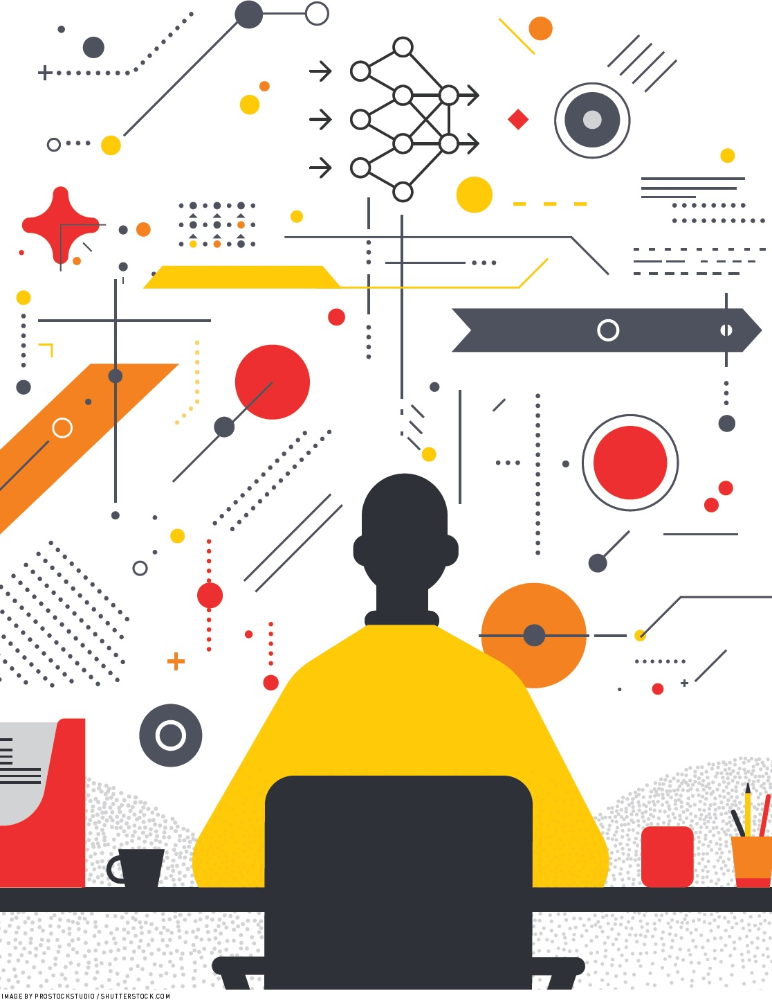

Mattias Rost's article "Reclaiming the Computer through LLM-mediated Computing" appears in the September/October 2025 issue of Interactions Magazine.

Excerpt: In the article Mattias reflects on how large language models (LLMs) are reshaping how people interact with computers. He proposes a human-centred approach to "LLM-mediated computing" that reclaims agency by designing interfaces, workflows, and norms that foreground user intent, transparency, and collaborative control—rather than treating LLMs as opaque black-box assistants.

<!--more-->

Read the article on Interactions Magazine:

https://interactions.acm.org/archive/view/september-october-2025/reclaiming-the-computer-through-llm-mediated-computing
 

