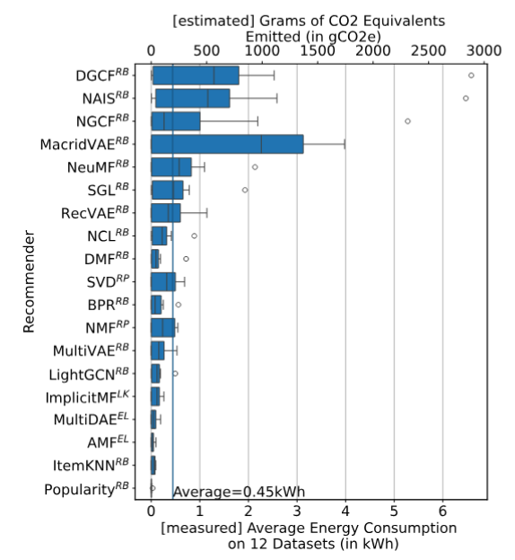

A new paper from our group on Green Recommender Systems examines strategies to reduce the energy and carbon footprint of recommendation pipelines while maintaining recommendation quality. The work evaluates efficiency-aware algorithms and measurement practices, and proposes practical guidelines for researchers and practitioners aiming to make recommender systems more sustainable.

<!--more-->

Read the full paper:

- ACM Digital Library: https://dl.acm.org/doi/10.1145/3768626
- DOI: https://doi.org/10.1145/3768626

This work builds on and extends collaborations with visiting researchers from the University of Siegen — see our earlier post about their visit: [Visiting Researchers from University of Siegen](/post/24-02-23-Visiting-researchers-from-uni-siegen/)

