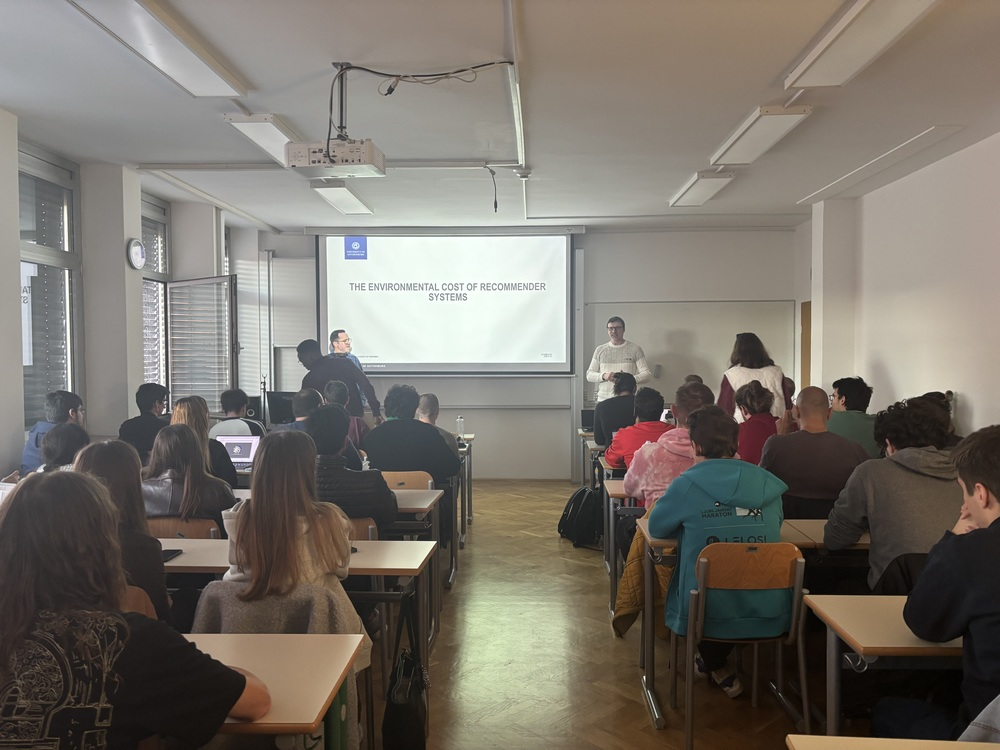

Alan gave a guest lecture at the University of Primorska on 12 November 2025, presenting "The Environmental Cost of Recommender Systems." <!--more-->

He summarised a study featured at ACM RecSys 2024 that analysed 79 recommender-system papers (2013–2023) and found that deep-learning-based approaches emit, on average, 42× more CO₂ equivalents than traditional methods. The talk covered practical examples from our projects, discussed evaluation and sustainability challenges, and included time for questions with students and staff.

